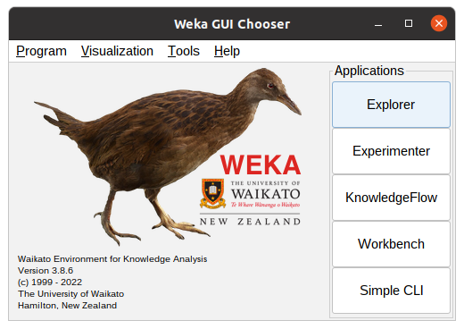
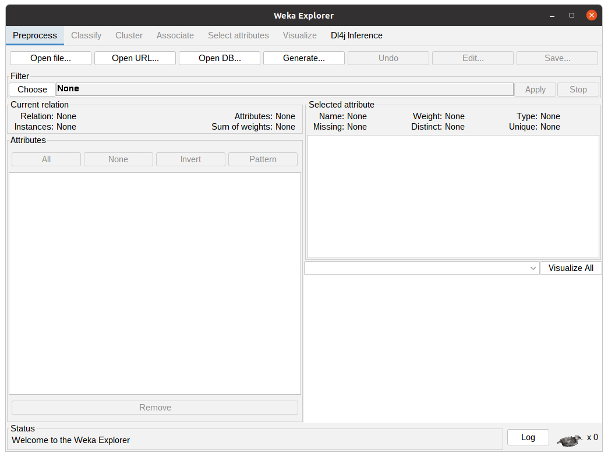
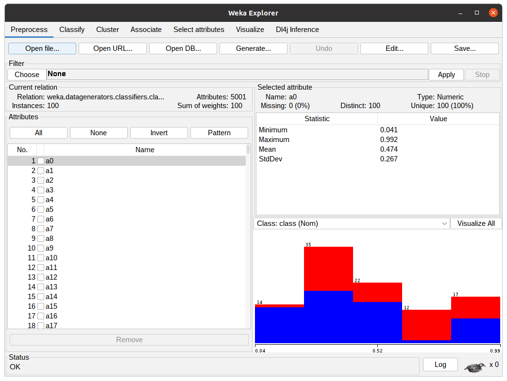
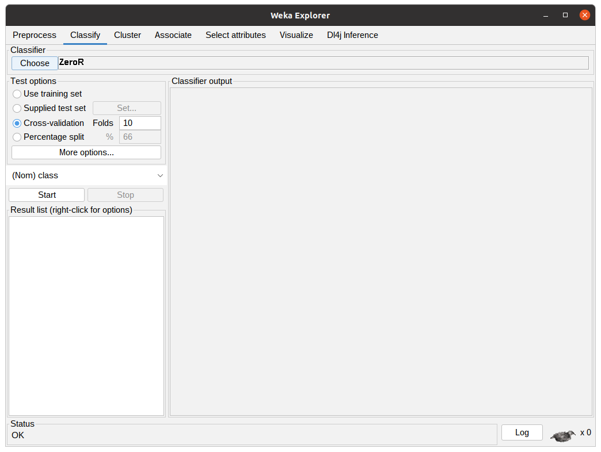
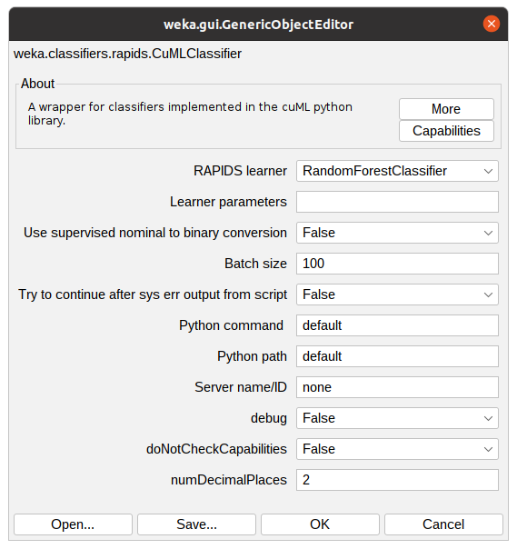
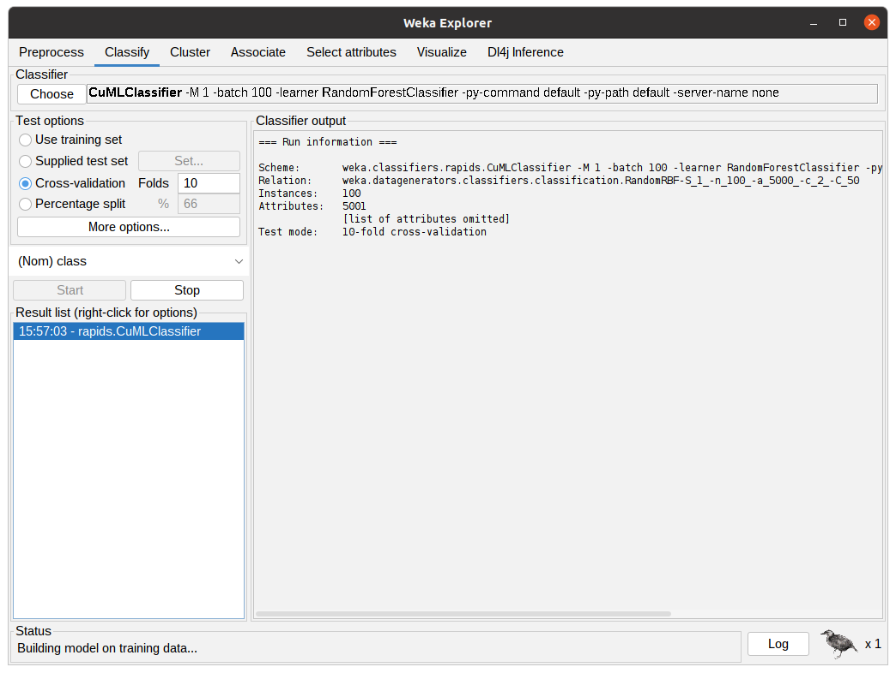
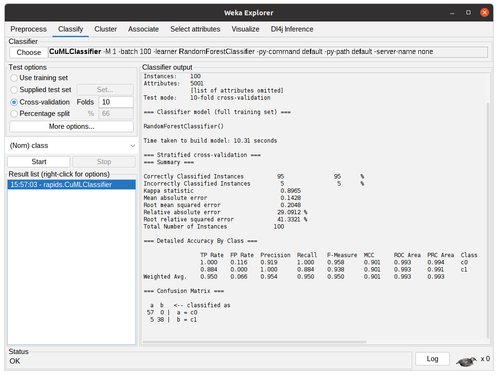

AcceleratedWEKA offers the same options as the standard WEKA. 


## Running a quick example with the GUI
<!-- The installation of Accelerated WEKA itself is pretty simple. It is available through Conda, a system providing package and environment management. Such capability means that a simple command can install all dependencies for the project. For example, on a Linux machine, issue the following command in a terminal for installing Accelerated WEKA and all dependencies.

```bash
conda create --solver=libmamba -n accelweka -c rapidsai -c nvidia -c conda-forge  -c waikato weka
```

Once Conda has created the environment, activate it with the following command:

```bash
conda activate accelweka
```

This terminal instance just loaded all dependencies for Accelerated WEKA. Launch WEKA GUI Chooser with the command:

```bash
weka
``` -->
Launch WEKA with the command:
```bash
weka
```

The following window will appear

From there, click the Explorer button to access the functionalities of Accelerated WEKA.



In the WEKA Explorer window, click the Open file button to select a dataset file. WEKA works with ARFF files but can read from CSVs. Converting from CSVs can be pretty straightforward or require some configuration by the user, depending on the types of the attributes.



Assuming one does not want to preprocess the data, clicking the Classify tab will present the classification options to the user. 



In this tab, the user can configure the classification algorithm and the test options that are going to be used in the experiment using the previously selected dataset. 

Clicking “Choose” button will show the implemented classifiers. Some might be disabled because of the dataset characteristics. To use Accelerated WEKA, the user must select rapids.CuMLClassifier. After that, clicking the bold CuMLClassifier will take the user to the option windows for the classifier.



After configuring the Classifier according to the previous step, the parameters will be shown in the text field beside the Choose button. After clicking Start, WEKA will start executing the chosen classifier with the dataset. The following figure shows the classifier in action, the Classifier output is showing debug and general information regarding the experiment, such as parameters, classifiers, dataset, and test options. The status shows the current state of the execution and the Weka bird on the bottom animates and flips from one side to the other while the experiment is running.



After the algorithm finishes the task it will output the summary of the execution with information regarding predictive performance and the time taken. In the following figure, the output shows the results for 10-fold cross-validation using the RandomForestClassifier from cuML through CuMLClassifier.




## Running a quick example with the command line

To run a quick example with the command line there are two easy steps.

1. First, let's create a small dataset just to get the hang of how to use Accelerated WEKA (except the new learner classes, it is the same as using standard WEKA):
```sh
weka -main weka.Run .RandomRBF -n 10000 -a 50 > RBFa50n10k.arff
```

2. Let's go through the arguments of the above command:  
    - **weka** is the main program, if you are using this command alone it launches the GUI. If you insert other arguments it can run tasks from the terminal.
    - **-main weka.Run** indicates that we want to run the class *weka.Run*. In other words, we want to run straight from the command line, as opposed to the default *weka.gui.GUIChooser* that launches the GUI.
    - **.RandomRBF** is the class that we want to use. This is a relative reference for the generator class that creates datasets with a Radial function.
    - **-n 10000** is one of the possible arguments for the *RandomRBF* class, it indicates that we want a dataset with ten thousand instances.
    - **-a 50** is another one of the *RandomRBF* arguments, it sets the number of attributes on the dataset to 50.
    - **>> RBFa50n10k.arff** is the bash *append operator* followed by the *file name* that we want to write to.

3. Then, let's use the newly created dataset to run some of the new RAPIDS algorithms using the GPU.
```sh
 weka -memory 48g -main weka.Run weka.classifiers.rapids.CuMLClassifier -split-percentage 80 -learner RandomForestClassifier -t $(pwd)/RBFa5kn10k.arff -py-command python
```

4. Again, let's go through the arguments of the above command:
    - **-memory 48g** sets the JVM maximum heap to 48 gigabytes.
    - **weka.classifiers.rapids.CuMLClassifier** is the class responsible for integrating RAPIDS to WEKA.
    - **-split-percentage 80** means that we want to split the dataset into two smaller ones. We should train with 80% of the dataset and test with the remaining 20%.
    - **-learner RandomForestClassifier** indicates which RAPIDS classifier/regressor we want to use in our experiment.
    - **-t $(pwd)/RBFa5kn10k.arff** sets the previously created dataset as the input for our experiment.
    - **-py-command python** is an optional command just to make sure we are using the correct python command and to modify the python call in case we need to.

5. After the code is run, you will get the result. Check accuracy and time taken.

6. Now, let's run another RAPIDS learner with the same dataset. This time, try using the Support Vector classifier (SVC):
```sh
weka -memory 48g -main weka.Run weka.classifiers.rapids.CuMLClassifier -split-percentage 80 -learner SVC -t $(pwd)/RBFa5kn10k.arff -py-command python
```

7. Notice the only difference is the argument of the **-learner** option.

8. Compare the results with the RandomForestClassifier.

9. Feel free to explore the other supported learners from RAPIDS. You can find a comprehensive list of them in [Features](https://waikato.github.io/acceleratedWEKA/Introduction/features/).
